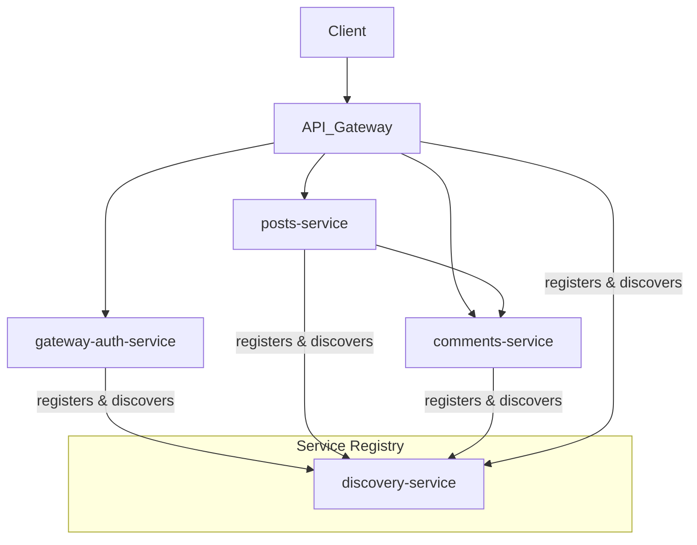

# Microservices Project

## Services

The project consists of the following microservices:

*   **discovery-service**: A service registry and discovery server (Eureka).
*   **gateway-service**: An API gateway that provides a single entry point for all the microservices.
*   **gateway-auth-service**: Authentication service integrated with the gateway.
*   **posts-service**: A service for managing posts.
*   **comments-service**: A service for managing comments.

## How to Run

Each service is a Spring Boot application and can be run individually.

### Prerequisites

*   Java 17 or later
*   Maven

### Running the services

1.  **Start the discovery-service:**
    ```bash
    cd discovery-service
    mvn spring-boot:run
    ```
    The Eureka server will be available at http://localhost:8761.

2.  **Start the gateway-service:**
    ```bash
    cd gateway-service
    mvn spring-boot:run
    ```

3.  **Start the gateway-auth-service:**
    ```bash
    cd gateway-auth-service
    mvn spring-boot:run
    ```

4.  **Start the posts-service:**
    ```bash
    cd posts-service
    mvn spring-boot:run
    ```

5.  **Start the comments-service:**
    ```bash
    cd comments-service
    mvn spring-boot:run
    ```
You can also run multiple instances of the `comments-service` by navigating into `comments-service2` and `comments-service3` and running the same command.

## Architecture



## API Routes

### Comments Service (`/api/comments`)

*   **GET `/port`**
    *   **Use Case**: Returns the port number on which the `comments-service` instance is running. This is useful for debugging and verifying which service instance is handling a request in a multi-instance setup.

*   **GET `/`**
    *   **Use Case**: Retrieves a complete list of all comments stored in the system.

*   **POST `/`**
    *   **Use Case**: Creates a new comment. The comment information should be provided in the request body.

*   **GET `/{postid}`**
    *   **Use Case**: Fetches all comments associated with a specific post, identified by the `postid`.

### Posts Service (`/api/posts`)

*   **GET `/`**
    *   **Use Case**: Retrieves a complete list of all posts.

*   **POST `/`**
    *   **Use Case**: Creates a new post. The post information should be provided in the request body.

*   **GET `/{postid}`**
    *   **Use Case**: Retrieves all comments for a given post by communicating with the `comments-service`. This demonstrates inter-service communication. It includes a fallback mechanism to return dummy data if the `comments-service` is not available.

*   **GET `/port`**
    *   **Use Case**: Gets the port from the `comments-service`. This is another example of service-to-service communication.

# SocialHub
